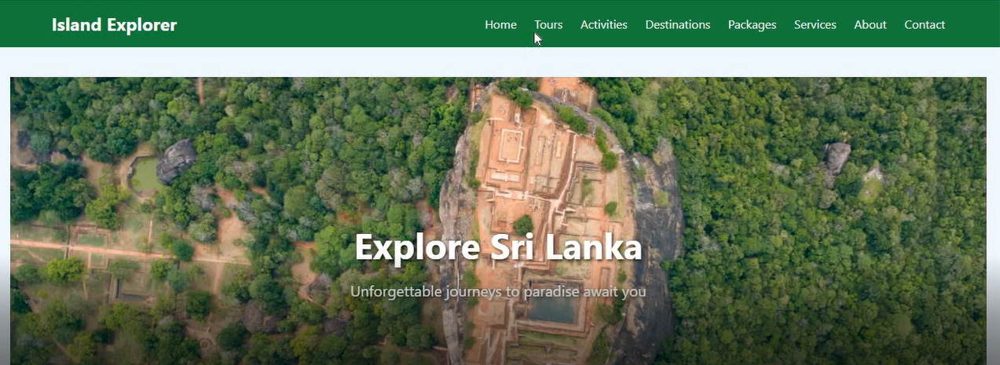

# 🌴 Island Explorer - Sri Lanka Tour Website

A responsive and interactive tourism website built using **React**. Users can explore destinations, view activities, and send booking/inquiry emails directly via **EmailJS** — no backend required!

---

## 🚀 Live Demo

---
## ✨ Features

- 🏖️ Explore beautiful destinations in Sri Lanka
- 🏕️ Activity highlights with engaging visuals
- 📨 Booking/inquiry form with **EmailJS integration**
- 📱 Fully responsive (mobile & desktop friendly)
- 📧 Emails directly delivered to your inbox

---

## 🔧 Tech Stack

- React.js (Vite)
- EmailJS (via `@emailjs/browser`)
- CSS / Inline Styling
- Vercel (Deployment)

---

## 🚀 Author
 **Safeeya Munawwar**

  
  
  
  
  

---

© 2025 Island Explorer | Built with ❤️ using React, CSS, EmailJS
